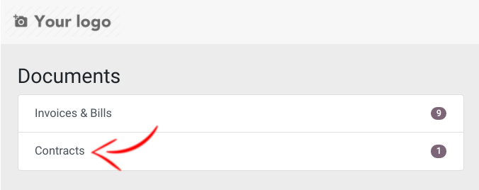
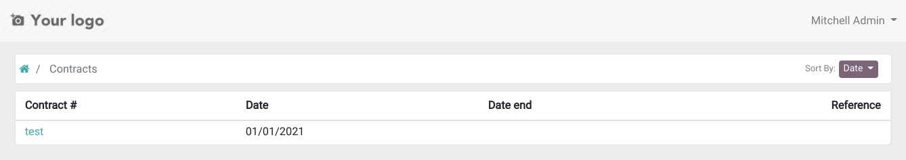
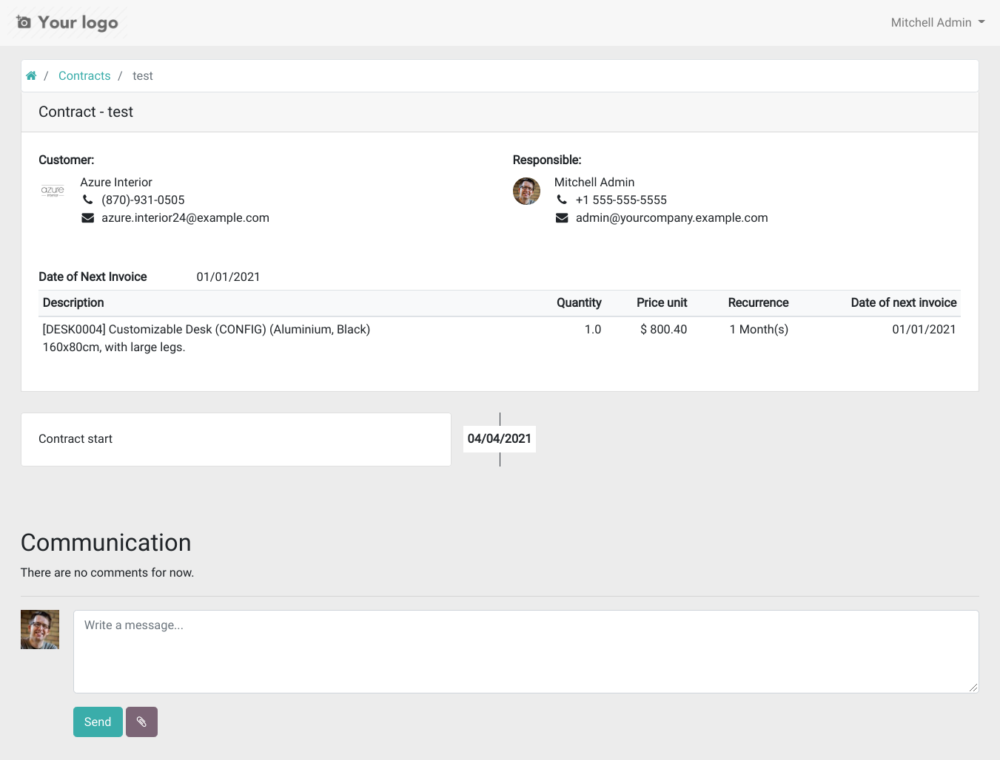

1.  Contracts are in Invoicing -\> Customers -\> Customer and Invoicing
    -\> Vendors -\> Supplier Contracts
2.  When creating a contract, fill fields for selecting the invoicing
    parameters:
    - a journal
    - a price list (optional)
3.  And add the lines to be invoiced with:
    - the product with a description, a quantity and a price
    - the recurrence parameters: interval (days, weeks, months, months
      last day or years), start date, date of next invoice
      (automatically computed, can be modified) and end date (optional)
    - auto-price, for having a price automatically obtained from the
      price list
    - \#START# - \#END# or \#INVOICEMONTHNAME# in the description field
      to display the start/end date or the start month of the invoiced
      period in the invoice line description
    - pre-paid (invoice at period start) or post-paid (invoice at start
      of next period)
    - an invoicing offset, to move the invoice away from that date (see
      below)
4.  The "Generate Recurring Invoices from Contracts" cron runs daily to
    generate the invoices. If you are in debug mode, you can click on
    the invoice creation button.
5.  The *Show recurring invoices* shortcut on contracts shows all
    invoices created from the contract.
6.  The contract report can be printed from the Print menu
7.  The contract can be sent by email with the *Send by Email* button
8.  Contract templates can be created from the Configuration -\>
    Contracts -\> Contract Templates menu. They allow to define default
    journal, price list and lines when creating a contract. To use it,
    just select the template on the contract and fields will be filled
    automatically.

- Contracts appear in portal to following users in every contract:

## Shifting the invoice date

*Invoicing type* says whether a period is billed at its start (pre-paid)
or after it has run (post-paid). *Invoicing offset* moves that date, in
the unit chosen next to it.

A positive offset delays the invoice. A negative one issues it earlier,
which is how you invoice up front: set `-1` with *Month(s)* on a pre-paid
monthly line and the invoice for March is raised on 1 February.

For a period running from 1 to 31 March, billed monthly:

| Invoicing type | Offset | Unit    | Invoice issued |
|----------------|-------:|---------|----------------|
| Pre-paid       |      0 | Day(s)  | 1 March        |
| Pre-paid       |     -1 | Month(s)| 1 February     |
| Pre-paid       |     15 | Day(s)  | 16 March       |
| Post-paid      |      0 | Day(s)  | 1 April        |
| Post-paid      |      2 | Week(s) | 15 April       |
| Post-paid      |    -10 | Day(s)  | 22 March       |

Post-paid already includes the day after the period ends, which is why an
offset of 0 lands on 1 April rather than 31 March.

The quickest way to check a setting is to watch *Date of Next Invoice* on
the line. It recomputes as soon as the offset changes, so the effect is
visible before anything is invoiced.
