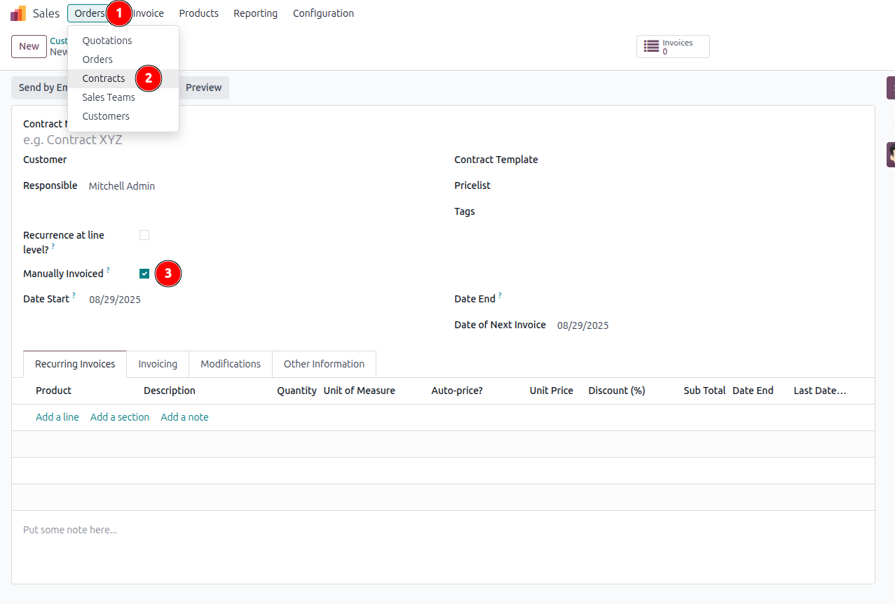
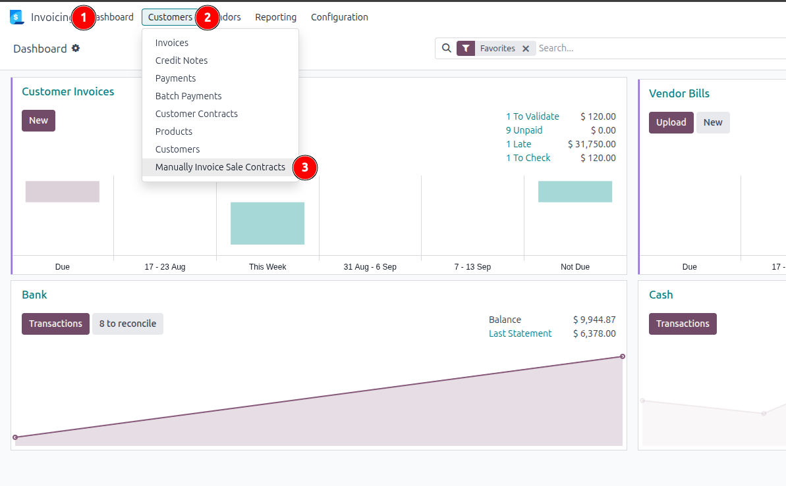
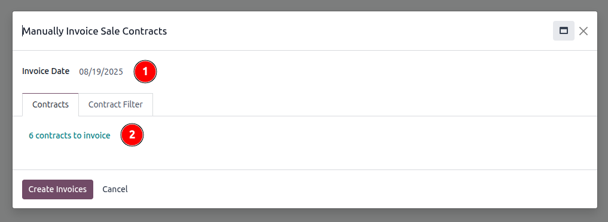
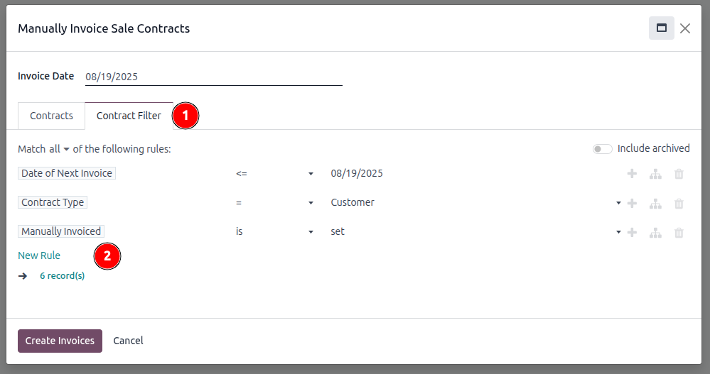

If that’s not the case, please make sure that every usage step is covered and remember that images speak more than words!]

To use this module, you need to:

1. Go to *Sales* > Orders > Contracts > Contract > **Manually Invoiced**

2. Go to *Invoicing* or *Accounting* >
  - Customers > **Manually Invoice Sale Contracts** or
  - Vendors > **Manually Invoice Purchase Contracts**
    *insert screenshot!*

- Select a date
- Check number of contracts to invoice
  
- Modify filter to further specify contracts to invoice
  
- The *Manually Invoiced* filter can be removed if needed
